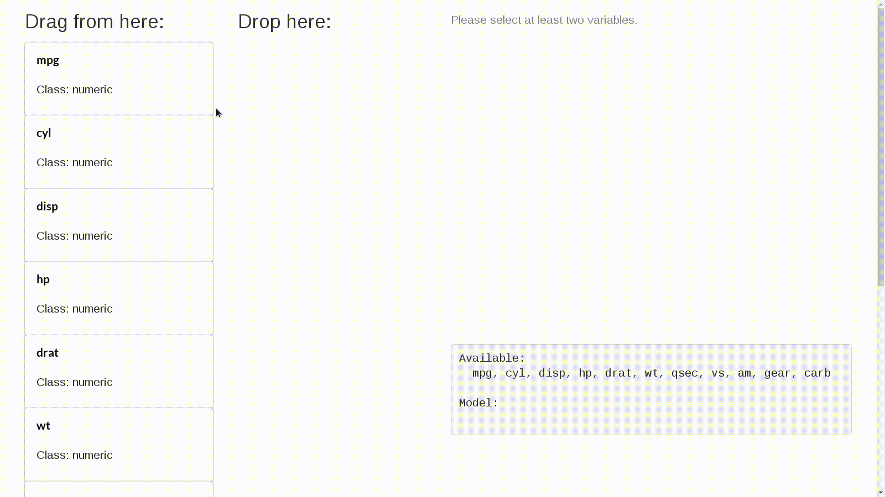
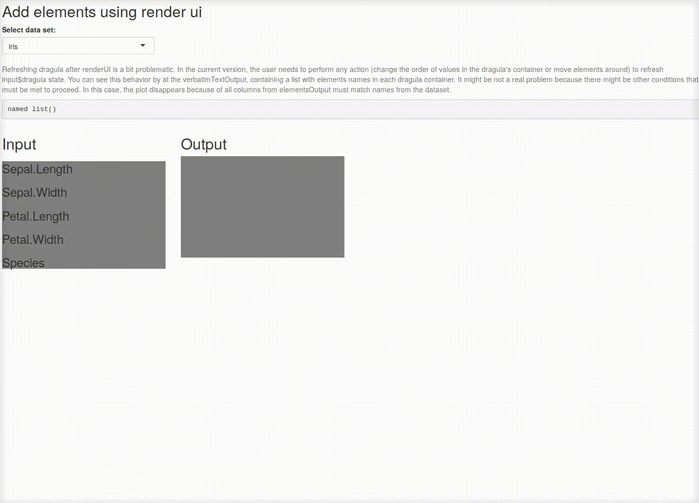

# Drag'n'drop elements with *dragulaR*

[](https://travis-ci.org/zzawadz/dragulaR)
[](https://ci.appveyor.com/project/zzawadz/dragulaR)
[](https://codecov.io/github/zzawadz/dragulaR?branch=master)
[](https://cran.r-project.org/package=dragulaR)
[](https://cran.rstudio.com/package=dragulaR)
[](https://cran.rstudio.com/web/packages/dragulaR/index.html)

R's interface for ***[dragula](https://github.com/bevacqua/dragula)*** library for moving around elements in shiny app.

## Installation:

```r
source("https://install-github.me/zzawadz/dragulaR")
```

## Demo:

### Drag'n'drop plots:

```r
library(dragulaR)
runApp(system.file("apps/example01-dragula", package = "dragulaR"))
```


### Track what is in the containers:

```r
runApp(system.file("apps/example02-input", package = "dragulaR"))
```



### Works with `renderUI`

```r
runApp(system.file("apps/example06-dragula-dynamic-elements-renderUI", package = "dragulaR"))
```



```r
runApp(
  system.file("apps/example06-dragula-dynamic-elements-renderUI", package = "dragulaR"),
  display.mode = "showcase")
```

### Pass options to `dragula`

See [dragula README](https://github.com/bevacqua/dragula#dragulacontainers-options) for valid options. 

```r
runApp(
  system.file("apps/example07-dragula-input-options", package = "dragulaR"),
  display.mode = "showcase")
```

### All examples

```r
library(dragulaR)
dir(system.file("apps/", package = "dragulaR"))
# dashboard-example
# example01-dragula
# example02-input
# example03-dragula-get-elements-order
# example04-dragula-module
# example05-dragula-dynamic-elements
# example06-dragula-dynamic-elements-renderUI
# example07-dragula-input-options
```
