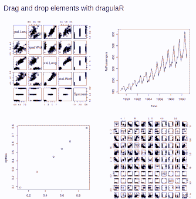
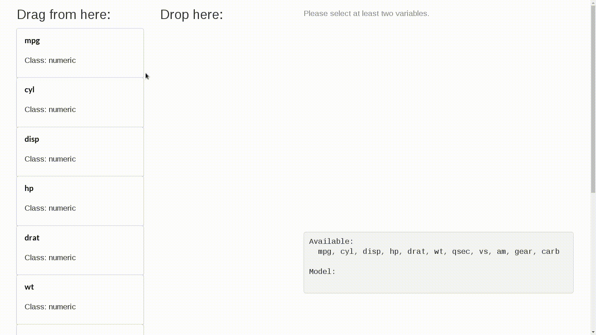
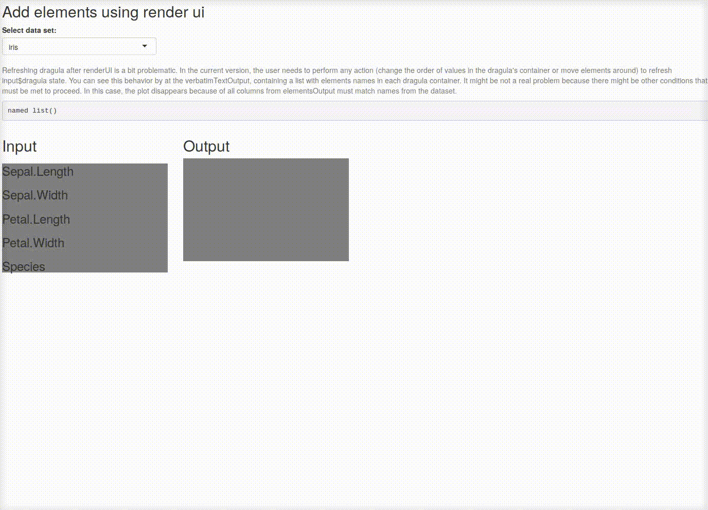

# Drag'n'drop elements with *dragulaR*

[](https://codecov.io/github/zzawadz/dragulaR?branch=master)
[](https://cran.r-project.org/package=dragulaR)
[](https://cran.rstudio.com/package=dragulaR)
[](https://cran.rstudio.com/web/packages/dragulaR/index.html)

R's interface for ***[dragula](https://github.com/bevacqua/dragula)*** library for moving around elements in shiny app.

## Installation:

```r
source("https://install-github.me/zzawadz/dragulaR")
```

## Live examples

Every app in `inst/apps/` is also published as a static
[Shinylive](https://posit-dev.github.io/r-shinylive/) build - it runs entirely in
the browser via WebAssembly, with no Shiny server involved.

To build the site yourself:

```r
# shinylive resolves the wasm binary from where dragulaR was installed,
# so install it from r-universe to get the development build
install.packages("dragulaR", repos = "https://zzawadz.r-universe.dev")
install.packages(c("shinylive", "shinydashboard"))
```

```sh
Rscript tools/build-shinylive.R _shinylive
Rscript -e 'httpuv::runStaticServer("_shinylive")'
```

The output in `_shinylive/` is static files only, so it can be served from
GitHub Pages or any static host.

## Demo:

### Drag'n'drop plots:

```r
library(dragulaR)
runApp(system.file("apps/example01-dragula", package = "dragulaR"))
```


### Track what is in the containers:

```r
runApp(system.file("apps/example02-input", package = "dragulaR"))
```



### Works with `renderUI`

```r
runApp(system.file("apps/example06-dragula-dynamic-elements-renderUI", package = "dragulaR"))
```



```r
runApp(
  system.file("apps/example06-dragula-dynamic-elements-renderUI", package = "dragulaR"),
  display.mode = "showcase")
```

### Pass options to `dragula`

See [dragula README](https://github.com/bevacqua/dragula#dragulacontainers-options) for valid options.

```r
runApp(
  system.file("apps/example07-input-options", package = "dragulaR"),
  display.mode = "showcase")
```

### Limit maximum items in a container

Use the `maxItems` option to restrict the number of items that can be dropped into a container:

```r
# Limit "Model" container to 3 items maximum
dragula(c("Available", "Model"), maxItems = list(Model = 3))

# Run the example app
runApp(system.file("apps/example08-max-items", package = "dragulaR"))
```

### All examples

```r
library(dragulaR)
dir(system.file("apps/", package = "dragulaR"))
# dashboard-example
# example01-dragula
# example02-input
# example03-dragula-get-elements-order
# example04-dragula-module
# example05-dragula-dynamic-elements
# example06-dragula-dynamic-elements-renderUI
# example07-input-options
# example08-max-items
```
